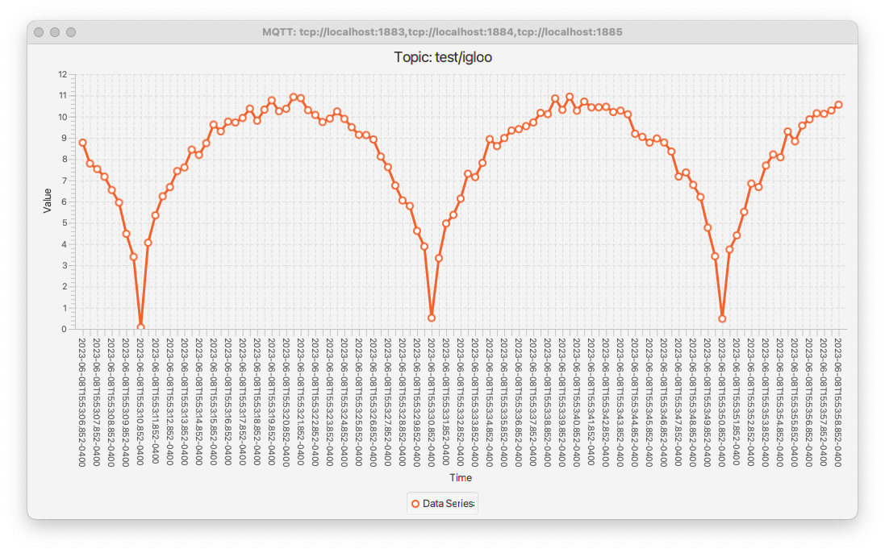

 [*PadoGrid*](https://github.com/padogrid) | [*Catalogs*](https://github.com/padogrid/catalog-bundles/blob/master/all-catalog.md) | [*Manual*](https://github.com/padogrid/padogrid/wiki) | [*FAQ*](https://github.com/padogrid/padogrid/wiki/faq) | [*Releases*](https://github.com/padogrid/padogrid/releases) | [*Templates*](https://github.com/padogrid/padogrid/wiki/Using-Bundle-Templates) | [*Pods*](https://github.com/padogrid/padogrid/wiki/Understanding-Padogrid-Pods) | [*Kubernetes*](https://github.com/padogrid/padogrid/wiki/Kubernetes) | [*Docker*](https://github.com/padogrid/padogrid/wiki/Docker) | [*Apps*](https://github.com/padogrid/padogrid/wiki/Apps) | [*Quick Start*](https://github.com/padogrid/padogrid/wiki/Quick-Start)

---
# Data Feed Simulator

This bundle includes a data feed simulator for generating continous numerical data.

## Installing Bundle

```bash
install_bundle -download bundle-none-app-simulator
```

## Use Case

The Data Feed Simulator publishes numerical data computed by a set of equations. By adding noise (jitter) to the computed values, you can produce simulated data for real-world applications. There are a number of useful data feeds included in this bundle. You can customize them or introduce your own equations to generate based on your application requirements.



## Required Software

- PadoGrid 0.9.25+
- Mosquitto 2.x

## Bundle Contents

```console
simulator
├── bin_sh
│   ├── build_app
│   ├── chart
│   ├── setenv.sh
│   └── simulator
├── etc
│   ├── log4j2.properties
│   ├── mqttv5-client.yaml
│   ├── simulator-edge.yaml
│   ├── simulator-logging.properties
│   ├── simulator-misc.yaml
│   ├── simulator-padogrid.yaml
│   ├── simulator-stocks.yaml
│   └── template-simulator-padogrid.yaml
└── src
    └── main
        └── java
```

## Configuring Bundle Environment

Build the simulator application as follows. The `build_app` script compiles the provided simulator source code.

```bash
cd_app simulator/bin_sh
./build_app
```

## Startup Sequence

### 1. Start Mosquitto cluster

```bash
make_cluster -product mosquitto
switch_cluster mymosquitto
start_cluster
```

### 2. Start simulator

```bash
# First, build the simulator. The following compiles the provided simulator source code.
cd_app simulator/bin_sh
./build_app

# Start simulator
./simulator
```

### 3. Start simulator

```bash
cd_app simulator/bin_sh
```

### 4. Display data in trending chart

By default, the `simulator` command loads the `etc/simulator-padogrid.yaml` file, which defines numerouse equations. Each equation is invoked by the paired publisher which defines the topic to publish the data. Take a look at the configuration file and select the topics that you want to view in charts. 

```bash
cd_app simulator/bin_sh
cat etc/simulator-padogrid.yaml
```

Display the data by running the `chart` command which takes a single topic as an argument. Try running the following examples.

```bash
# Display sine wave
chart -t test/sine

# Display damped sine wave
chart -t test/dampedSineWave
```

Appliation specific data feeds are defined in `etc/simulator-stock.yaml` and `etc/simulator-misc.yaml`. Try running them.

First start the simulator:

```bash
./simulator -config ../etc/simulator-stocks.yaml
./simulator -config ../etc/simulator-misc.yaml
```

Run charts:

```bash
# Display simulator-stocks.yaml
chart -t test/stock1
chart -t test/stock2

# Display simulator-misc.yaml
chart -t /test/igloo
chart -t test/temperature
chart -t test/carcost
chart -t test/heartbeat
```

## Tuning data feeds

Each equation defined in the configuration file can be tuned to fit your needs. The [`etc/template-simulator-padogrid.yaml`](apps/simulator/etc/template-simulator-padogrid.yaml) provides detailed parameter descriptions.

```bash
cd_app simulator
cat etc/template-simulator-padogrid.yaml
```

Output:

```yaml
# Define one or more equations
equations:
    # Required unique equation name. Required for configuring publisher
  - name: null

    # Optional equation formula (for documentation only)
    # Example: y=sin(x)
    formula: null

    # Optional equation description (for documentation only)
    description: null

    # Optional time format.
    # Default: "yyyy-MM-dd'T'HH:mm:ss.SSSZ"
    timeFormat: "yyyy-MM-dd'T'HH:mm:ss.SSSZ"

    # Optional start time. Must conform to timeFormat. Ex: "2022-10-10T09:00:00.000-0400"
    # Default: current time.
    startTime: "2022-10-10T09:00:00.000-0400"

    # Optional time interval in milliseconds
    # Default: 500
    timeInterval: 500

    # Optional miniumn base (x) value. The base is equivalent to x in y=x.
    # Default: -1
    minBase: -1

    # Optional maximum base (x) value. The base is equivalent to x in y=x.
    # Default: 1
    maxBase: 1

    # Optional base value spread (delta). x is incremented by this value before each calculation.
    # Default: 0.1
    baseSpread: 0.1

    # Optional percentage of the random number to add to the equation result before
    # the base average (maxBase-minBase) is added to the computed value.
    # Default: 0.1
    jitter: 0.1

    # Optional multiplier. The jitter computed value is multiplied by this value. Set this attribute
    # to amplify or deamplify the final value.
    # Default: 1.0
    multiplier: 1.0

    # Calculation function. Must be a static method with the following signature.
    #    public final double my_function(double x);
    # The following classes contain useful functions.
    #   java.lang.Math
    #    padogrid.simulator.eq.Equations
    # Example: java.lang.Math.sin
    #          padogrid.simulator.eq.circle
    # Must specify one of calculationFunction and calculationClass. calculationFunction overrides
    # calculationClass.
    calculationFunction: null

    # Calculation class. Must implement padogrid.simulator.ICalculation.
    # Must specify one of calculationFunction and calculationClass. calculationFunction overrides
    # calculationClass.
    calculationClass: null

    # Optional constant value. This value is added to the value returned by the calculation function.
    # Set this attribute to move the curve up or down along the y-axis.
    # Default: 0
    constant: 0

    # Optional cycle type. Valid values are REPEAT, REVERSE (case sensitive). If REPEAT, each
    # caculation cycle increases the base value starting from minBase. If REVERSE, upon reaching the
    # maxBase value, the caculation cycle is reversed by decrementing the base value.
    # Default: REVERSE
    type: REVERSE

publishers:
  # MQTT
    # Required product name.
    # Valid values are mqtt, hazelcast
  - product: mqtt

    # Required unique publisher name.
    name: null

    # Required equation name. This must be one of the equation names defined in
    # in the equations element.
    equationName: null

    # Data structure. Each product has one or more data structure types as follows.
    #
    # - mqtt
    #     dataStructure:
    #       type: topic
    #       name: <topic_name>
    #
    # - hazelcast
    #     dataStructure:
    #       type: map
    #       name: <map_name>
    #     dataStructure:
    #       type: rmap
    #       name: <replicated_map_name>
    #     dataStructure:
    #       type: queue
    #       name: <queue_name>
    #     dataStructure:
    #       type: topic
    #       name: <topic_name>
    dataStructure:
      type: null
      name: null

    # Initial delay in milliseconds. The publisher waits this amount of time before start
    # publishing data.
    # Default: 0
    initialDelay: 0

    # Time interval in milliseconds. The publisher periodically publishes data at this
    # interval.
    interval: 500
```

## Adding new equations

You can add your own equations by creating Java static functions. All equation functions take the following form.

```java
public final static double function(x) {
   return <computed_value>;
}
```

For example, the following defines linear and quadratic equations.

```java
package mydatafeed;

publid class MyEquations {
   public final static double linear(double x) {
      return x + 1;
   }

   public final static double quadratic(double x) {
      return Math.pow(x, 2) + x + 1;
   }
}
```

You can place your source code in the `src/java/main/` directory and compile it by running the `build_app` command.

```bash
cd_app simulator/bin_sh
./build_app
```

To use your equations, you define them in the configuration file.

```bash
cd_app simulator
vi etc/simulator-mydatafeed.yaml
```

Enter the following `simulator-mydatafeed.yaml`:

```yaml
equations:
  - name: linear
    formula: y=x+1
    description: linear
    timeInterval: 500
    baseSpread: 0.1
    jitter: 0.1
    calculationFunction: mydatafeed.MyQueations.linear
  - name: quadratic
    formula: y=x^2+x+1
    description: quadratic
    timeInterval: 500
    baseSpread: 0.1
    jitter: 0.1
    calculationFunction: mydatafeed.MyQueations.quadratic

publishers:
  - product: mqtt
    name: linear-publisher
    equationName: linear
    dataStructure:
      type: topic
      name: mydatafeed/linear
    interval: 500
  - product: mqtt
    name: quadratic-publisher
    equationName: quadratic
    dataStructure:
      type: topic
      name: mydatafeed/quadratic
    interval: 500
```

Now, run simulator and chart.

```bash
cd_app simulator/bin_sh
./simulator -config ../etc/simulator-mydatafeed.yaml
./chart -t mydatafeed/linear
./chart -t mydatafeed/quadratic
```

## Teardown

```bash
# Ctrl-C simulator and exit charts

# Stop cluster
stop_cluster
```

## References

1. Graph Plotter, <https://www.transum.org/Maths/Activity/Graph/Desmos.asp>
1. *Mosquitto/MQTT Virtual Cluster Tutorial*, PadoGrid Bundles, <https://github.com/padogrid/bundle-mosquitto-tutorial-virtual-clusters>.
1. *Installing Mosquitto*, PadoGrid Manual, <https://github.com/padogrid/padogrid/wiki/Installing-Building-Mosquitto>
1. *MQTT Addon Library*, PadoGrid, <https://github.com/padogrid/padogrid/blob/develop/mqtt-addon-core/README.md>
1. *Mosquitto Overview*, PadoGrid Manual, <https://github.com/padogrid/padogrid/wiki/Mosquitto-Overview>
1. *Clustering MQTT*, PadoGrid Manual, <https://github.com/padogrid/padogrid/wiki/Clustering-MQTT>
1. *Eclipse Mosquitto*, <https://mosquitto.org/>
1. *Paho*, Eclipse Foundation, <https://www.eclipse.org/paho/>

---

 [*PadoGrid*](https://github.com/padogrid) | [*Catalogs*](https://github.com/padogrid/catalog-bundles/blob/master/all-catalog.md) | [*Manual*](https://github.com/padogrid/padogrid/wiki) | [*FAQ*](https://github.com/padogrid/padogrid/wiki/faq) | [*Releases*](https://github.com/padogrid/padogrid/releases) | [*Templates*](https://github.com/padogrid/padogrid/wiki/Using-Bundle-Templates) | [*Pods*](https://github.com/padogrid/padogrid/wiki/Understanding-Padogrid-Pods) | [*Kubernetes*](https://github.com/padogrid/padogrid/wiki/Kubernetes) | [*Docker*](https://github.com/padogrid/padogrid/wiki/Docker) | [*Apps*](https://github.com/padogrid/padogrid/wiki/Apps) | [*Quick Start*](https://github.com/padogrid/padogrid/wiki/Quick-Start)
