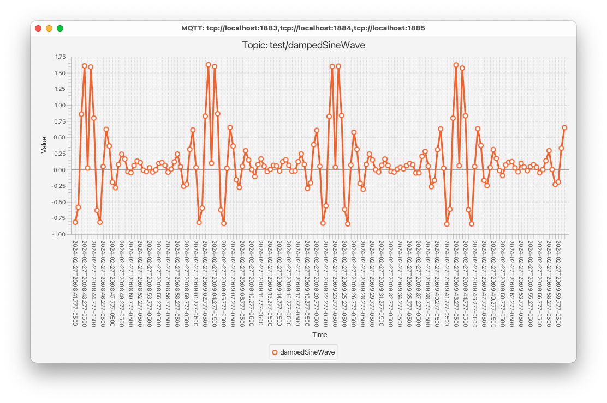
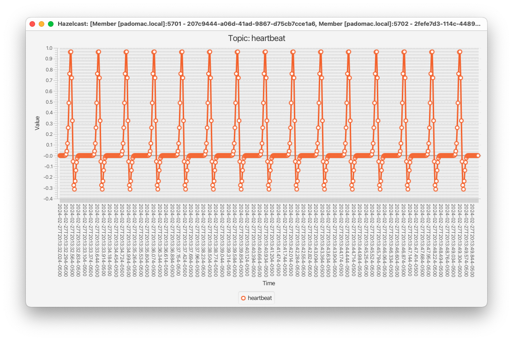
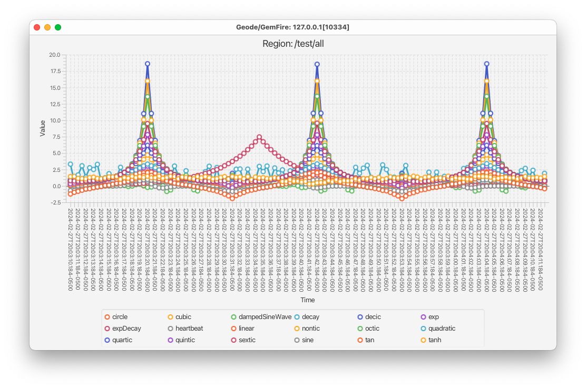

 [*PadoGrid*](https://github.com/padogrid) | [*Catalogs*](https://github.com/padogrid/catalog-bundles/blob/master/all-catalog.md) | [*Manual*](https://github.com/padogrid/padogrid/wiki) | [*FAQ*](https://github.com/padogrid/padogrid/wiki/faq) | [*Releases*](https://github.com/padogrid/padogrid/releases) | [*Templates*](https://github.com/padogrid/padogrid/wiki/Using-Bundle-Templates) | [*Pods*](https://github.com/padogrid/padogrid/wiki/Understanding-Padogrid-Pods) | [*Kubernetes*](https://github.com/padogrid/padogrid/wiki/Kubernetes) | [*Docker*](https://github.com/padogrid/padogrid/wiki/Docker) | [*Apps*](https://github.com/padogrid/padogrid/wiki/Apps) | [*Quick Start*](https://github.com/padogrid/padogrid/wiki/Quick-Start)

---

<!-- Platforms -->
[](https://github.com/padogrid/padogrid/wiki/Platform-PadoGrid-1.x) [](https://github.com/padogrid/padogrid/wiki/Platform-Host-OS) [](https://github.com/padogrid/padogrid/wiki/Platform-VM) [](https://github.com/padogrid/padogrid/wiki/Platform-Docker) [](https://github.com/padogrid/padogrid/wiki/Platform-Kubernetes)

# Data Feed Simulator

This bundle includes a data feed simulator for generating continous numerical data for MQTT and Hazelcast.

## Installing Bundle

```bash
install_bundle -download bundle-none-app-simulator
```

❗ This bundle is no longer compatible with PadoGrid 0.9.26 due to the recent changes made in the `HaMqttClient` API. Please use PadoGrid 0.9.27 or a later version.

## Use Case

The Data Feed Simulator publishes numerical data computed by a set of equations. By adding noise (jitter) to the computed values, you can produce simulated data for real-world applications. There are a number of useful data feeds included in this bundle. You can customize them or introduce your own equations to generate based on your application requirements.


## Required Software

- Mosquitto 2.x
- Hazelcast 5.x
- Geode 1.x or GemFire 9.x/10.x
- JDK 11+ (Required by JavaFX and Hazelcast Management Center)

## Bundle Contents

```console
apps
└── simulator
    ├── bin_sh
    │   ├── build_app
    │   ├── chart_geode
    │   ├── chart_hazelcast
    │   ├── chart_mqtt
    │   ├── setenv.sh
    │   └── simulator
    ├── etc
    │   ├── cache.xml
    │   ├── client-cache.xml
    │   ├── client-gemfire.properties
    │   ├── hazelcast-client.xml
    │   ├── log4j2.properties
    │   ├── mqttv5-client.yaml
    │   ├── mqttv5-hazelcast.yaml
    │   ├── mqttv5-questdb.yaml
    │   ├── mqttv5-simulator.yaml
    │   ├── simulator-edge.yaml
    │   ├── simulator-geode.yaml
    │   ├── simulator-hazelcast.yaml
    │   ├── simulator-logging.properties
    │   ├── simulator-misc.yaml
    │   ├── simulator-padogrid-all.yaml
    │   ├── simulator-padogrid.yaml
    │   ├── simulator-stocks.yaml
    │   └── template-simulator-padogrid.yaml
    ├── pom.xml
    └── src
        └── main
            ├── java
            └── resources
```

## Configuring Bundle Environment

First, make sure you have all the required products installed.

```bash
install_padogrid -product mosquitto
install_padogrid -product geode
install_padogrid -product hazelcast-oss
# Java must be downloaded manually. 'install_padogrid -?' provides instructions.
install_padogrid -?

update_padogrid -product mosquitto
update_padogrid -product geode
update_padogrid -product hazelcast-oss
update_padogrid -product java
```

Build the simulator application as follows. The `build_app` script compiles the provided simulator source code.

```bash
cd_app simulator/bin_sh
./build_app
```

## Startup Sequence

### 1. Start Mosquitto and/or Hazelcast

```bash
# Mosquitto
create_cluster -product mosquitto
switch_cluster mymosquitto
start_cluster 

# Geode
create_cluster -product geode
switch_cluster mygeode
# Copy cache.xml from the simulator app. This file defines all the
# regions used by the simulator.
cp ../../apps/simulator/etc/cache.xml etc/
start_cluster 

# Hazelcast
create_cluster -product hazelcast
switch_cluster myhz
start_cluster 
```

### 2. Build simulator

```bash
# Build the simulator if you haven't done so already
cd_app simulator/bin_sh
./build_app
```

### 3. Start simulator

```bash
cd_app simulator/bin_sh
./simulator
```

### 4. Display data in trending chart

By default, the `simulator` command loads the `etc/simulator-padogrid.yaml` file, which defines numerous equations. Each equation is invoked by the paired publisher which defines the data structure to publish the data. Take a look at the configuration file and select the data structure that you want to view in charts. 

```bash
cd_app simulator
cat etc/simulator-padogrid.yaml
```

#### 4.1. Display MQTT data in trending chart

Display the MQTT data by running the `chart_mqtt` command which takes a single topic as an argument.

```bash
cd_app simulator/bin_sh
./chart_mqtt -?
```

Output:

```console
NAME
   chart_mqtt - Chart the MQTT data published by the simulator

SNOPSIS
   chart_mqtt [[-cluster cluster_name] [-config config_file] | [-endpoints serverURIs]]
              [-fos fos] [-qos qos] [-features feature_list] [-time-format time_format] -t topic_filter [-?]

DESCRIPTION
   Charts the MQTT data published by the simulator.

   - If '-cluster' is specified and -config is not specified, then '-cluster'
     represents a PadoGrid cluster and maps it to a unique virtual cluster name.

   - If '-config' is specified, then '-cluster' represents a virtual cluster
     defined in the configuration file.

   - If '-config' is specified and '-cluster' is not specified, then the default
     virtual cluster defined in the configuration file is used.

   - If '-endpoints' is specified, then '-cluster' and '-config' are not allowed.

   - If '-cluster', '-config', and '-endpoints' are not specified, then the PadoGrid's
     current context cluster is used.

   - If PadoGrid cluster is not an MQTT cluster, then it defaults to endpoints,
     'tcp://localhost:1883-1885'.

OPTIONS
   -cluster cluster_name
             Connects to the specified PadoGrid cluster. Exits if it does not exist in the
             current workspace.

   -endpoints serverURIs
             Connects to the specified endpoints. Exits if none of the endpoints exist.
             Default: tcp://localhost:1883-1885

   -config config_file
             Optional HaMqttClient configuration file.

   -fos fos
             Optional FoS value. Valid values are 0, 1, 2, 3. Default: 0.

   -qos qos
             Optional QoS value. Valid values are 0, 1, 2. Default: 0.

   -features feature_list
             Optional comma separated list of features (attributes) to plot. If unspecified,
             it plots all numerical features.

   -time-format time_format
             Optional time format. The time format must match the 'time' attibute in the payload.
             Default: "yyyy-MM-dd'T'HH:mm:ss.SSSZ"

   -t topic_filter
             Topic filter.

SEE ALSO
   simulator(1)
   etc/mqttv5-client.yaml
   etc/simulator-edge.yaml
   etc/simulator-misc.yaml
   etc/simulator-padogrid.yaml
   etc/simulator-padogrid-all.yaml
   etc/simulator-stocks.yaml
   etc/template-simulator-padogrid.yaml
```

Try running the following examples.

```bash
cd_app simulator/bin_sh

# Display sine wave
./chart_mqtt -t test/sine

# Display damped sine wave
./chart_mqtt -t test/dampedSineWave
```



#### 4.2. `chart_geode`

Display the Geode/GemFire data by running the `chart_geode` command which takes a data structure type and name as arguments.

```bash
./chart_geode -?
```

Output:

```console
NAME
   chart_geode - Chart the Geode/GemFire data published by the simulator

SYNOPSIS
   chart_geode [-features feature_list] [-time-format time_format] [-window-size window_size] [-?]

DESCRIPTION
   Charts the Geode/GemFire data published by the simulator.

OPTIONS
   -name ds_name
             Data structure name, i.e., fully-qualified region path. Region paths must begin with '/'.

   -key key_value
             Key value to listen on. If unspecified, it plots updates for all
             key values. Specify this option for data structures configured
             'keyType: FIXED'.

   -features feature_list
             Optional comma separated list of features (attributes) to plot. If unspecified,
             it plots all numerical features.

   -time-format time_format
             Optional time format. The time format must match the 'time' attribute in the payload.
             Default: "yyyy-MM-dd'T'HH:mm:ss.SSSZ"

   -window-size
             Optional chart window size. The maximum number of data points to display before start
             trending the chart.
             Default: 1000

SEE ALSO
   simulator(1)
   etc/client-gemfire.properties
   etc/client-cache.xml
   etc/simulator-edge.yaml
   etc/simulator-geode.yaml
   etc/simulator-misc.yaml
   etc/simulator-padogrid.yaml
   etc/simulator-padogrid-all.yaml
   etc/simulator-stocks.yaml
   etc/template-simulator-padogrid.yaml
```

#### 4.3. `chart_hazelcast`

Display the Hazelcast data by running the `chart_hazelcast` command which takes a data structure type and name as arguments.

```bash
./chart_hazelcast -?
```

Output:

```console
NAME
   chart_hazelcast - Chart the Hazelcast data published by the simulator

SNOPSIS
   chart_hazelcast -name ds_name [-ds map|rmap|queue|topic|rtopic]
                   [-features feature_list] [-time-format time_format] [-?]

DESCRIPTION
   Charts the Hazelcast data published by the simulator.

OPTIONS
   -name ds_name
             Data structure name, i.e., topic name, map name, queue name, etc.

   -ds map|rmap|queue|topic|rtopic
             Data structure type. Default: topic

   -key key_value
             Key value to listen on. This option applies to map and rmap only. If
             unspecified, it plots updates for all key values. Specify this option for
             data structures configured with 'keyType: FIXED'.

   -features feature_list
             Optional comma separated list of features (attributes) to plot. If unspecified,
             it plots all numerical features.

   -time-format time_format
             Optional time format. The time format must match the 'time' attibute in the payload.
             Default: "yyyy-MM-dd'T'HH:mm:ss.SSSZ"

SEE ALSO
   simulator(1)
   etc/hazelcast-client.xml
   etc/simulator-edge.yaml
   etc/simulator-hazelcast.yaml
   etc/simulator-misc.yaml
   etc/simulator-padogrid.yaml
   etc/simulator-padogrid-all.yaml
   etc/simulator-stocks.yaml
   etc/template-simulator-padogrid.yaml
```

#### 4.4. Simulator configuration files

Application specific data feeds are defined in `etc/simulator-stocks.yaml` and `etc/simulator-misc.yaml`. Try running them.

First start the simulator:

```bash
cd_app simulator/bin_sh

# Stock prices
./simulator -simulator-config ../etc/simulator-stocks.yaml

# Miscellaneous data. For Geode/GemFire, it publishes data to region.
# For Hazelcast, it publishes data to map, rmap, queue, topic, and rtopic.
./simulator -simulator-config ../etc/simulator-misc.yaml
```

Run MQTT charts:

```bash
cd_app simulator/bin_sh

# Display simulator-stocks.yaml
./chart_mqtt -t test/stocks

# Display simulator-misc.yaml
./chart_mqtt -t test/igloo
./chart_mqtt -t test/temperature
./chart_mqtt -t test/carcost
./chart_mqtt -t test/heartbeat
```

Run Geode/GemFire charts:

```bash
# Display simulator-stocks.yaml
./chart_geode -name /stocks -ds region

# Display simulator-misc.yaml (publishes data to region)
./chart_geode -name /igloo -ds region
./chart_geode -name /temperature -ds region
./chart_geode -name /carcost -ds region
./chart_geode -name /heartbeat -ds region
```

Run Hazelcast charts:

```bash
# Display simulator-stocks.yaml
./chart_hazelcast -name stocks -ds topic

# Display simulator-misc.yaml (publishes data to map, rmap, queue, topic, rtopic)
./chart_hazelcast -name igloo -ds topic
./chart_hazelcast -name temperature -ds topic
./chart_hazelcast -name carcost -ds topic
./chart_hazelcast -name heartbeat -ds topic
```



The simulator supports multiple features per payload. Each payload represents an equation that generated data. For example, `etc/simulator-stocks.yaml` generates two (2) stock prices per payload. By default, the `chart_*` commands display all the numerical features found in the payload. To select features to display, sepcify the `-features` option. For example, the following displays only the `stock1` feature.

```bash
# MQTT
./chart_mqtt -t test/stocks -features stock1

# Geode/GemFire
./chart_geode -name /stocks -features stock1

# Hazelcast
./chart_hazelcast -name stocks -features stock1
```

The provided configuration files also include Hazelcast data structures other than topics.

```bash
cd_app simulator
vi etc/simulator-misc.yaml
```

For Geode/GemFire `Region` and Hazelcast `Map` and `Replicated Map`, these files have been configured with `keyType: FIXED` to update the same key. You can optionally, specify the '-key' option to plot updates on the specified key.

```bash
cd_app simulator/bin_sh

# Geode/GemFire
./chart_geode -name /carcost -ds region -key key

# Hazelcast
./chart_hazelcast -name carcost -ds map -key key
```

To configure key types other than 'FIXED', please see  `etc/template-simulator-padogrid.yaml` for details. For example, the following sets `keyType: SEQUENCE` to increment the key value starting from 1000.

```yaml
publishers:
...
  - product: geode
    enabled: true
    name: carcost-publisher
    # Interval between timestamps (msec). Timestamp is part of payload.
    # 1 day interval
    timeInterval: 86_400_000
    equations:
      equationNames: [carcost]
      # Time delay between equation executions (msec)
      equationDelay: 500
    dataStructure:
      type: region
      name: carcost
      keyType: SEQUENCE
      keySequenceStart: 1000

  - product: hazelcast
    enabled: true
    name: carcost-publisher
    # Interval between timestamps (msec). Timestamp is part of payload.
    # 1 day interval
    timeInterval: 86_400_000
    equations:
      equationNames: [carcost]
      # Time delay between equation executions (msec)
      equationDelay: 500
    dataStructure:
      type: map
      name: carcost
      keyType: SEQUENCE
      keySequenceStart: 1000
```

✏️  *Note that if `-ds queue` is specified, then `chart_hazelcast` first drains and plots existing entries in the Hazelcast `Queue` data structure before plotting updates.*

#### 4.5. `etc/simulator-padogrid-all.yaml`

The `etc/simulator-padogrid-all.yaml` file places all the features defined in `simulator-padogrid.yaml` into a single payload.

```bash
cd_app simulator/bin_sh
./simulator -simulator-config ../etc/simulator-padogrid-all.yaml

# MQTT
./chart_mqtt -t test/all

# Geode/GemFire
./chart_geode -name /test/all

# Hazelcast
./chart_hazelcast -name test/all
```



## Tuning Data Feeds

Each equation defined in the configuration file can be tuned to fit your needs. The [`etc/template-simulator-padogrid.yaml`](apps/simulator/etc/template-simulator-padogrid.yaml) provides detailed parameter descriptions.

```bash
cd_app simulator
cat etc/template-simulator-padogrid.yaml
```

Output:

```yaml
# Optional time format.
# Default: "yyyy-MM-dd'T'HH:mm:ss.SSSZ"
timeFormat: "yyyy-MM-dd'T'HH:mm:ss.SSSZ"

# Define one or more equations
equations:
    # Required unique equation name. Required for configuring publisher
  - name: null

    # Optional equation formula (for documentation only)
    # Example: y=sin(x)
    formula: null

    # Optional equation description (for documentation only)
    description: null

    # Optional minimum base (x) value. The base is equivalent to x in y=x.
    # Default: -1
    minBase: -1

    # Optional maximum base (x) value. The base is equivalent to x in y=x.
    # Default: 1
    maxBase: 1

    # Optional base value spread (delta). x is incremented by this value before each calculation.
    # Default: 0.1
    baseSpread: 0.1

    # Optional percentage of the random number to add to the equation result before
    # the base average, (maxBase-minBase)/2, is added to the computed value.
    # Default: 0.1
    jitter: 0.1

    # Optional multiplier. The jitter computed value is multiplied by this value. Set this
    # attribute to amplify or deamplify the final value.
    # Default: 1.0
    multiplier: 1.0

    # Calculation function. Must be a static method with the following signature.
    #    public final double my_function(double x);
    # The following classes contain useful functions.
    #   java.lang.Math
    #    padogrid.simulator.eq.Equations
    # Example: java.lang.Math.sin
    #          padogrid.simulator.eq.circle
    # Must specify one of calculationFunction and calculationClass. calculationFunction overrides
    # calculationClass.
    calculationFunction: null

    # Calculation class. Must implement padogrid.simulator.ICalculation.
    # Must specify one of calculationFunction and calculationClass. calculationFunction overrides
    # calculationClass.
    calculationClass: null

    # Optional constant value. This value is added to the value returned by the calculation
    # function. Set this attribute to move the curve up or down along the y-axis.
    # Default: 0
    constant: 0

    # Optional cycle type. Valid values are REPEAT, REVERSE (case sensitive). If REPEAT, each
    # calculation cycle increases the base value starting from minBase. If REVERSE, upon reaching
    # the maxBase value, the calculation cycle is reversed by decrementing the base value.
    # Default: REVERSE
    type: REVERSE

publishers:
    # Product name. Valid values are MQTT|GEODE|GEMFIRE|HAZELCAST
    # Required product name.
    # Default: MQTT
  - product: MQTT

    # Optional parameter to enable (true) or disable (false) the publisher.
    # Default: true
    enabled: true

    # Required unique publisher name.
    name: null

    # Initial delay in milliseconds. The publisher waits this amount of time before start
    # publishing data.
    # Default: 0
    initialDelay: 0

    # Time interval in milliseconds. Timestamp is advanced by this interval per equation execution.
    # Timestamp is included in the payload with the key 'time'.
    timeInterval: 500

    # Start time in 'timeFormat'. The timestamp (base time) begins at 'startTime' and incremented
    # by `timeInterval' per equation execution.
    # Default: current time
    startTime: null

    # Required equations. List one or more equation names defined in the root equations
    # element.
    equations:
      # List of equations to execute.
      equationNames: []

      # Equation delay time in milliseconds. The publisher periodically delays this long before
      # publishing data. Set this attribute to control the rate at which data is published.
      # The minimum value is 1. If less than or equal to 0, then it is overwritten to 1.
      # Default: 500
      equationDelay: 500

    # Data structure. Each product has one or more data structure types as follows.
    #
    # - mqtt
    #     dataStructure:
    #       type: TOPIC
    #       name: <topic_name>
    #
    # - geode
    #     # Geode/GemFire dataStructure default is REGION
    #     dataStructure:
    #       type: REGION
    #       name: <fully-qualified region_path> (must begin with '/')
    #       keyType: FIXED|SEQUENCE|TIME|UUID
    #       keySequenceStart: 1
    #
    # - hazelcast
    #     # Hazelcast dataStructure default is TOPIC
    #     dataStructure:
    #       type: MAP|RMAP|QUEUE|TOPIC|RTOPIC
    #       name: <map_name>
    #       keyType: FIXED|SEQUENCE|TIME|UUID
    #       keySequenceStart: 1
    #     dataStructure:
    #       type: RMAP
    #       name: <replicated_map_name>
    #       keyType: FIXED|SEQUENCE|TIME|UUID
    #       keySequenceStart: 1
    #     dataStructure:
    #       type: QUEUE
    #       name: <queue_name>
    #     dataStructure:
    #       type: TOPIC
    #       name: <topic_name>
    #     dataStructure:
    #       type: RTOPIC
    #       name: <reliable_topic_name>
    dataStructure:
      # Required data structure type.
      #   MQTT valid valued: TOPIC)
      #   Geode/GemFire valid values: REGION|MAP (REGION and MAP are equivalent)
      #   Hazelcast valid values: MAP|RMAP|QUEUE|TOPIC|RTOPIC
      # Default: TOPIC
      type: TOPIC

      # Required data structure name.
      #   MQTT: Topic name
      #   Geode/GemFire: Name of region
      #   Hazelcast: Name of map, replicated map, queue, topic, or reliable topic
      # Default: null <undefined>
      name: null

      # Key type. Applies to Geode/GemFire and Hazelcast data structures only. All keys are string.
      # Valid values are SEQUENCE|TIME|UUID.
      #    FIXED - Key value is a single fixed value. Set keyValue as the key value.
      #    SEQUENCE - Key values are sequenced starting from keySequenceStart.
      #    TIME - Key values are time stamps
      #    UUID - Key values are UUID.
      # Default: SEQUENCE
      keyType: FIXED

      # Key value for the FIXED key type.
      # Default: key
      keyValue: key

      # Key sequence start number. Key sequence is incremented starting from this number.
      # Default: 1
      keySequenceStart: 1

    # Max number of values to publish. If this attribute is set, then the publisher stops
    # after publishing the specified number of values. The simulator stops when all the
    # publishers have stopped. If you want to stop after a complete cycle between 'minBase'
    # and 'maxBase', then set the 'reset.iterations' attribute instead. To publish
    # indefinitely, set a negative value.
    # Default: -1 (no max. publish forever)
    maxCount: -1

    # Optional reset. Set this element to reset the base time when it reaches 'minBase'
    # or 'maxBase'. By resetting the base time, you can simulate a repeatable time capsule
    # on a window of curve captured by 'minBase' and 'maxBase'.
    reset:
      # Set the equation that will be used to reset the base time. This equation serves
      # as the basis for other equations if there are more than one (1) equation.
      equationName: null

      # Base time reset in milliseconds. This value is added to the base time when the base
      # (x) value when it reaches 'minBase' or 'maxBase'. The current base time is first
      # reset to the date portion, and then this value is added to it as shown in the
      # following example.
      #
      #   reset.resetBaseTime: 86_400_000 (1 day)
      #   startTime: "2022-10-10T09:00:00.000-0400"
      #   base time: "2024-11-11T11:12:34.565-0400"
      #   new base time: "2024-11-11T09:00:00.000-0400" + resetStartTime
      #   new base time: "2024-11-12T09:00:00.000-0400"
      #
      # The default value of 0 does nothing and proceeds with the current base time.
      #
      # Default: 0
      resetBaseTime: 0

      # Number of iterations. The simulator increments the iteration count when the base reaches
      # `minBase` or 'maxBase'. When the iteration count reaches this value, the simulator
      # stops the publisher. The simulator terminates when all the publishers stop. For
      # indefinite iterations, set a negative value.
      # Default: -1 (continue forever)
      iterations: -1
```

## Adding New Equations

You can add your own equations by creating Java static functions. All equation functions take the following form.

```java
public final static double function(double x) {
   return <computed_value>;
}
```

For example, the following defines linear and quadratic equations.

```java
package mydatafeed;

publid class MyEquations {
   public final static double linear(double x) {
      return x + 1;
   }

   public final static double quadratic(double x) {
      return Math.pow(x, 2) + x + 1;
   }
}
```

You can place your source code in the `src/java/main/` directory and compile it by running the `build_app` command.

```bash
cd_app simulator/bin_sh
./build_app
```

To use your equations, you define them in the configuration file.

```bash
cd_app simulator
vi etc/simulator-mydatafeed.yaml
```

Enter the following `simulator-mydatafeed.yaml`:

```yaml
equations:
  - name: linear
    formula: y=x+1
    description: linear
    baseSpread: 0.1
    jitter: 0.1
    calculationFunction: mydatafeed.MyQueations.linear
  - name: quadratic
    formula: y=x^2+x+1
    description: quadratic
    baseSpread: 0.1
    jitter: 0.1
    calculationFunction: mydatafeed.MyQueations.quadratic

publishers:
  - product: mqtt
    name: my-publisher
    # Interval between timestamps (msec). Timestamp is part of payload.
    timeInterval: 500
    equations:
      equationNames: [linear, quadratic]
      # Time delay between equation executions (msec)
      equationDelay: 500
    dataStructure:
      type: topic
      name: mydatafeed/mydata
```

Now, run `simulator` and `chart_mqtt`.

```bash
cd_app simulator/bin_sh
./simulator -simulator-config ../etc/simulator-mydatafeed.yaml
./chart_mqtt -t mydatafeed/mydata
```

## QuestDB

QuestDB is an open source columnar time-series database ideal for storing data generated by IoT devices. This bundle includes the [`QuestDbJsonConnector`](apps/simulator/src/main/java/padogrid/mqtt/connectors/QuestDbJsonConnector.java)  plugin that automatically inserts the MQTT streamed data into QuestDB. 

1. Run QuestDB container

```bash
docker run --name questdb -p 9000:9000 -p 9009:9009 -p 8812:8812 questdb/questdb
```

2. **If you are running the simulator from inside the PadoGrid container,** then you need to change the QeustDB host name in the `HaMqttClient` configuration file as follows.

✏️  *Skip this step if you are running the simulator from your host OS.*

From the host OS, find the QuestDB container IP address.

```bash
docker inspect -f '{{range.NetworkSettings.Networks}}{{.IPAddress}}{{end}}' questdb
```

Output:

```console
172.17.0.4
```

Enter the QuestDB IP address in the `etc/mqttv-questdb.yaml` file.

```bash
cd_app simulator
vi etc/mqttv-questdb.yaml
```

For our example, the IP address is `172.17.0.4` as shown below.

```yaml
...
    className: padogrid.mqtt.connectors.QuestDbJsonConnector
    properties:
      - key: endpoint
        value: 172.17.0.4:9009
...
```

If you are running an older version of PadoGrid Docker image, then the QuestDB Java API will fail. This is due to [`glibc` compatibility issues](https://github.com/jxyang/gcompat). You can overcome this by setting `LD_PRELOAD` before running the simulator as follows.

✏️  *This step is not necessary for newer versions of the PadoGrid image (v0.9.27+), which have `LD_PRELOAD` already set.*

```bash
export LD_PRELOAD=/lib/libgcompat.so.0
```

3. Run simulator


```bash
cd_app simulator/bin_sh
./simulator -config ../etc/mqttv5-questdb.yaml -simulator-config ../etc/simulator-stocks.yaml
./simulator -config ../etc/mqttv5-questdb.yaml -simulator-config ../etc/simulator-padogrid-all.yaml
```

4. Open QuestDB console

URL: <http://127.0.0.1:9000/>


## Simulator Plugin

This bundle also includes a simulator plugin that can be embedded in virtual clusters. The MQTT configuration file, `etc/mqttv5-simulator.yaml`, defines the plugin as follows.

```bash
cd_app simulator
cat etc/mqttv5-simulator.yaml
```

Output:

```yaml
...
plugins:
  # Data feed plugin APP that generates simulated data
  - name: datafeed
    description: A data feed that publishes simulated numerical data for MQTT and Hazelcast with QuestDB enabled
    enabled: true
    context: APP
    className: padogrid.simulator.DataFeedSimulatorPlugin
...
clusters:
  - name: edge
    enabled: true
    autoConnect: true
    fos: 0
    publisherType: ROUND_ROBIN

    # QuestDB connector. Enable or disable in the 'plugins' element.
    pluginNames: [questdb]
...
```

Take a look at [`DataFeedSimulatorPlugin`](apps/simulator/src/main/java/padogrid/simulator/DataFeedSimulatorPlugin.java). It implements `IMqttPlugin` which extends `Runnable`. The virtual cluster service bootstraps the plugin in a daemon thread during the application startup time. Typically, plugins are highly configurable and resuable such that you can create embedded virtual clusters without needing to code.

You can use the `HaMqttClient` API to embed plugins in your application or simply use the `vc_start` command as follows.

1. Display the simulator plugin usage.

```bash
cd_app simulator
vc_start -config mqtt5-simulator.yaml -?
```

2. Start the simulator plugin.

```bash
vc_start -config etc/mqttv5-simulator.yaml -simulator-config etc/simulator-stocks.yaml
```

✏️  *Note that the [`DataFeedSimulator`](apps/simulator/src/main/java/padogrid/simulator/DataFeedSimulator.java) class launched by the `simulator` command also invokes `padogrid.simulator.DataFeedSimulatorPlugin`.*

## Teardown

```bash
# Ctrl-C simulator and exit charts

# Stop and remove QuestDB docker container
docker stop questdb
docker rm questdb

# Stop cluster
stop_cluster -cluster mymosquitto
stop_cluster -cluster mygeode -all
stop_cluster -cluster myhz -all
```

## References

1. Graph Plotter, <https://www.transum.org/Maths/Activity/Graph/Desmos.asp>
1. *Mosquitto/MQTT Virtual Cluster Tutorial*, PadoGrid Bundles, <https://github.com/padogrid/bundle-mosquitto-tutorial-virtual-clusters>.
1. *Installing Mosquitto*, PadoGrid Manual, <https://github.com/padogrid/padogrid/wiki/Installing-Building-Mosquitto>
1. *MQTT Addon Library*, PadoGrid, <https://github.com/padogrid/padogrid/blob/develop/mqtt-addon-core/README.md>
1. *Mosquitto Overview*, PadoGrid Manual, <https://github.com/padogrid/padogrid/wiki/Mosquitto-Overview>
1. *Clustering MQTT*, PadoGrid Manual, <https://github.com/padogrid/padogrid/wiki/Clustering-MQTT>
1. *Eclipse Mosquitto*, <https://mosquitto.org/>
1. *Paho*, Eclipse Foundation, <https://www.eclipse.org/paho/>
1. *Fast SQL for time-series*, QuestDB, <https://questdb.io/>

---

 [*PadoGrid*](https://github.com/padogrid) | [*Catalogs*](https://github.com/padogrid/catalog-bundles/blob/master/all-catalog.md) | [*Manual*](https://github.com/padogrid/padogrid/wiki) | [*FAQ*](https://github.com/padogrid/padogrid/wiki/faq) | [*Releases*](https://github.com/padogrid/padogrid/releases) | [*Templates*](https://github.com/padogrid/padogrid/wiki/Using-Bundle-Templates) | [*Pods*](https://github.com/padogrid/padogrid/wiki/Understanding-Padogrid-Pods) | [*Kubernetes*](https://github.com/padogrid/padogrid/wiki/Kubernetes) | [*Docker*](https://github.com/padogrid/padogrid/wiki/Docker) | [*Apps*](https://github.com/padogrid/padogrid/wiki/Apps) | [*Quick Start*](https://github.com/padogrid/padogrid/wiki/Quick-Start)
